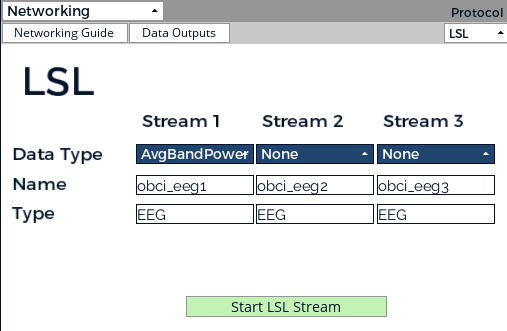
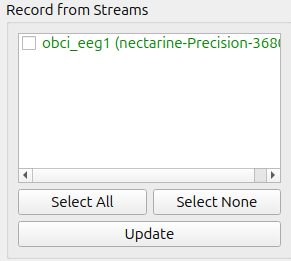
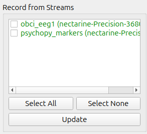
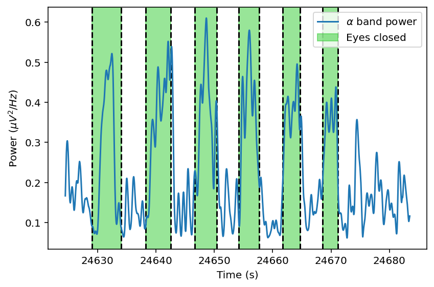

# Psychopy_code

## EEG Setup
- Clean and wipe the electrodes, possibly with an alcohol pad.
- Switch on the USB dongle (the switch should be on the side of the USB port) and plug it in a USB port. A blue LED should switch on.
- Switch on the CYTON board by putting the switch either on the lower or upper positions (middle position is OFF). A blue LED should switch on.
- Do not forget to switch off the equipment at the end of the session in order not to drain the batteries.
- Install the headset: https://docs.openbci.com/GettingStarted/Biosensing-Setups/EEGSetup/
 
Additional documents on EEG recordings with the Cyton board are located in the "Handouts" folder.
test
 
## OpenBCI GUI
- Install the OpenBCI GUI: https://docs.openbci.com/Software/OpenBCISoftware/GUIDocs/
  The default installation path on Linux is often /home/username
- On Linux, it can be launched by moving to openbcigui_v6.0.0-beta.1_linux64/OpenBCI_GUI and executing ./OpenBCI_GUI
- Under “DATA SOURCE”, select CYTON (live), then “Serial (from Dongle)”
- Check the channel count is 8 (for one Cython board), and modify the recording parameters if necessary, then click “AUTO-CONNECT” and “Start Data Stream”
- Some sanity checks for signal quality:
  - In the Time series panel, check that the signal shape is correct on all electrodes (see typical shapes of good EEG time series: https://en.wikipedia.org/wiki/Electroencephalography) and verify that muscle artifacts appear e.g. when blinking on the frontal electrodes.
  - In the Cyton Signal panel, click “Check All Channels” and verify the impedance of all electrodes. In most panels, electrodes with bad signal can be disabled by clicking “Channels” and highlighting only the desired electrodes.
  - Verify the Berger effect (i.e. an increased power in the alpha power band upon eyes closure) can be seen in the “Band Power” panel.
 
## Sending OpenBCI signal to LabRecorder
Signals from the OpenBCI headset can be sent to LabRecorder (e.g. to synchronize them with other signals, such as triggers from Psychopy). Triggers and EEG recordings are mixed within the LSL, which can be installed using the instructions below. In the “Networking” panel of the OpenBCI GUI:
- Choose “LSL” as protocol
- Up to 3 streams (e.g. time series or band powers) can be sent simultaneously. For instance, the following configuration will send the Average Band Power (i.e. the output visible in the “Band Power” panel) to LabRecorder. More information on the different data types (and especially how the vectors are structured) can be found by clicking “Data Outputs”.

- Click “Start LSL Stream”.

See also https://openbci.com/forum/index.php?p=/discussion/comment/21540#Comment_21540

## LabRecorder
- Install LabRecorder: https://github.com/labstreaminglayer/App-LabRecorder.
- Launch LabRecorder. On Linux, its default installation path is often usr/bin and it is launched with ./LabRecorder
- Click “Update” and verify that the stream from the OpenBCI GUI appears in the list of streams (see image below).

Once both the Psychopy experiment and the EEG GUI are running, their streams will appear
(https://docs.openbci.com/Software/CompatibleThirdPartySoftware/LSL/) and can be recorded. They will be saved as .xdf files, which can then be read in Python (see below).

## PsychoPy
The following toy experiments can be opened using the PsychoPy builder:
- In toy_experiment_1, a trigger (of value 1) will be sent whenever the user presses the spacebar.
- In toy_experiment_2, after a waiting time of 10s (to leave  some time to start the recording on LabRecorder), 10 triggers (labeled from 1 to 10) will be automatically sent (with an inter-trigger interval of 1s).

Once the PsychoPy experiment is running, click “Update” in LabRecorder. The second stream (i.e. coming from PsychoPy) should appear along the stream coming from the OpenBCI GUI.

Click “Start” to record the streams under the path and name specified in “Study_root” and “File Name/Template”, and then “Stop” at the end of the experiment.

## Data reading
Outputs from LabRecorder are .xdf files, which can be open using e.g. Python. The data_reading.py script shows how to open and use a .xdf file. Assuming that the OpenBCI stream was AvgBandPower with name “obci_eeg1” and that the PsychoPy stream was coming from toy_experiment_1, the python script will read the most recent output from LabRecorder and will plot the alpha band power (i.e. the third column from the OpenBCI stream) along with the PsychoPy triggers.

## To do

In the above example, I sent a trigger (dashed vertical lines) whenever I closed or opened my eyes. An alpha band power increase coincides with periods of closed eyes (i.e. Berger effect), which is a telltale sign of good synchronization between EEG streams and triggers. The accuracy of this synchronization could be further validated by manually sending triggers at the same time via Psychopy and via Cyton (https://openbci.com/forum/index.php?p=/discussion/4099/streaming-accel-aux-data-via-the-networking-widget#latest) and checking both triggers are synchronized.
